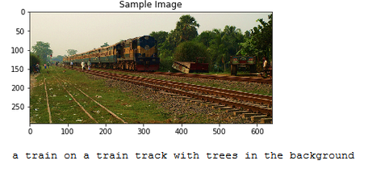
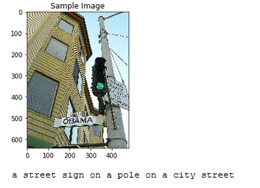
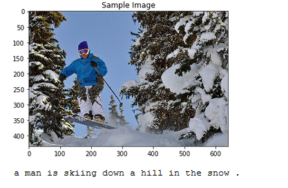

# Image-captioning

## Overview
In this project, a CNN-LSTM encoder-decoder model was used to generate captions for images automatically. A complex deep learning model is used comprising of two components: a Convolutional Neural Network (CNN) that transforms an input image into a set of features - encoding the information in an image into a vector (known as embedding, which is a featurized representation of the image), and an RNN that turns those features into descriptive language.


## File description
```Notebook 0:``` Initializes the COCO API (the "pycocotools" library), used to access data from the MS COCO (Common Objects in Context) dataset. <br/>
```Notebook 1:``` uses the pycocotools, torchvision transforms, and NLTK to preprocess the images and the captions for network training. It also explores the EncoderCNN and DecoderRNN. <br/>
```model.py:``` Architecture and ```forward()``` functions for encoder and decoder. <br/>
```Notebook 2:``` Selection of hyperparameter values and training. The hyperparameter selections are explained. <br/>
```Notebook 3:``` Using the trained model to generate captions for images in the test dataset. <br/>
```data_loader.py:``` Custom data loader for PyTorch combining the dataset and the sampler. <br/>
```vocabulary.py:``` Vocabulary constructor built from the captions in the training dataset. <br/>

## Encoder-Decoder model
<br/>
This is the complete architecture of the image captioning model. The CNN encoder basically finds patterns in images and encodes it into a vector that is passed to the LSTM decoder that outputs a word at each time step to best describe the image. Upon reaching the ```<end>``` token, the entire caption is generated and that is our output for that particular image.

## Results:
 <br/>
 <br/>
 <br/>

